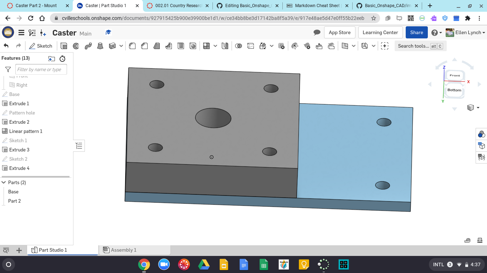

# Caster
We were working on the first part of the Caster. The base is the first piece. 
It was simple and easy to make. 

# Mount
We were making the mount, and I didn't realize you had to be in the sketch to use the tool Use, which is good to know for future reference. Once I got over that hiccup, it was really easy and quick. 

